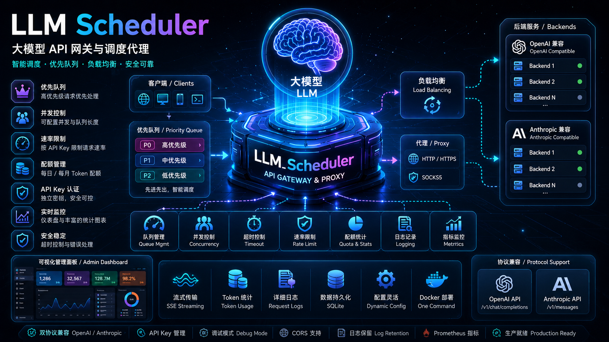

> [**中文版本**](./README.zh.md) | [**English Version**](./README.md)
>
> **Detailed API Documentation: [English Documentation](./DOCS.md) | [中文文档](./DOCS.zh.md)**

<p align="center">
  
</p>

# LLM Scheduler

A production-grade LLM API gateway proxy with priority queueing, concurrency control, API Key authentication, and an embedded admin dashboard.

## Features

- **Dual Protocol Support**: Compatible with both OpenAI and Anthropic API formats, with independently configurable backends
- **Load Balancing**: Round-robin across multiple backends supporting the same protocol; individual backends can be enabled/disabled independently
- **Priority Queue**: Requests are prioritized by API Key; high-priority requests jump the queue
- **Concurrency Control**: Configurable concurrency limit; returns 429 when queue is full
- **Queue Timeout**: Configurable wait timeout; returns 408 on timeout
- **Rate Limiting**: API Key-level request rate limiting (requests/minute); returns 429 when exceeded
- **Token Quota**: API Key-level daily/monthly token usage quotas; rejects requests when exceeded
- **Log Retention**: Automatic log cleanup with configurable retention days and maximum record count
- **Streaming Passthrough**: SSE event streams forwarded transparently without modification
- **Token Statistics**: Automatic recording of input/output token counts for both streaming and non-streaming requests
- **Dashboard Charts**: Chart.js time-series charts with 1h/6h/24h/7d/30d period switching
- **Debug Mode**: Saves full request/response bodies to disk for troubleshooting
- **API Key Authentication**: Independent API keys with configurable enable/disable
- **Admin Login**: Custom login page with Session/Cookie-based authentication; bcrypt password hashing with legacy plaintext fallback
- **Proxy Support**: Forwards backend requests through HTTP/HTTPS/SOCKS5 proxy servers
- **CORS Support**: Configurable cross-origin request sources
- **Structured Logging**: JSON format with full request lifecycle records (including token usage and trace ID)
- **Prometheus Metrics**: Queue length, request latency, processing time, backend request duration, token counts
- **Health Check & Failover**: Automatic backend health probing with unhealthy-node skipping; `/health/ready` for readiness probes
- **Request Cancellation**: Cancel queued requests via `DELETE /v1/queue/{request_id}`
- **Model-level Routing**: Route requests to specific backends by model name (exact match > wildcard > protocol fallback)
- **Dark Mode & Responsive**: CSS dark mode with localStorage persistence; hamburger-menu responsive layout for mobile
- **Embedded Admin Panel**: Sci-fi themed UI for managing API Keys, viewing logs, statistics, and dashboard
- **Docker Deployment**: One-command startup with persistent data storage

## Quick Start

### Local Run

```bash
# 1. Create virtual environment and install dependencies
uv sync

# 2. Edit configuration (config.local.yaml will automatically override config.yaml)
cp config.yaml config.local.yaml
# Modify openai_backend.base_url, anthropic_backend.base_url, etc. (or configure via admin panel after startup)
# Unset values will use code defaults

# 3. Start (automatically uses virtual environment)
uv run python -m app.main
```

### Docker Compose

```bash
# 1. Edit config file
vim config.yaml  # Modify startup config (server, admin credentials, etc.)

# 2. Start
docker-compose up -d

# 3. View logs
docker-compose logs -f
```

### Bare Docker

```bash
# Build
docker build -t llm-scheduler .

# Run
docker run -d \
  --name llm-scheduler \
  -p 8001:8001 \
  -v $(pwd)/config.yaml:/app/config.yaml:ro \
  -v gateway-data:/app/data \
  llm-scheduler
```

## Configuration

`config.yaml` contains startup-level settings (server, auth, admin, database, queue, logging, log_retention, cors, proxy). Runtime configuration (queue, priority, backend, debug, metrics, proxy) can be managed via the admin panel.

For the full configuration reference including all default values, see [Configuration Reference](./DOCS.md#configuration-reference) in the detailed documentation.

## Basic Usage

```bash
# OpenAI-compatible request
curl http://localhost:8001/v1/chat/completions \
  -H "Authorization: Bearer sk-your-api-key" \
  -H "Content-Type: application/json" \
  -d '{"model": "gpt-4", "messages": [{"role": "user", "content": "Hello"}], "stream": true}'

# Anthropic-compatible request
curl http://localhost:8001/v1/messages \
  -H "Authorization: Bearer sk-your-api-key" \
  -H "Content-Type: application/json" \
  -d '{"model": "claude-3-opus-20240229", "max_tokens": 1024, "messages": [{"role": "user", "content": "Hello"}], "stream": true}'

# Cancel a queued request
curl -X DELETE http://localhost:8001/v1/queue/{request_id} \
  -H "Authorization: Bearer sk-your-api-key"

# Check queue status (public, no auth required)
curl http://localhost:8001/v1/queue
```

For the complete API reference with all endpoints, request/response schemas, and examples, see [API Reference](./DOCS.md#api-reference).

## Admin Panel

Access `http://localhost:8001/admin` in your browser and log in with the configured admin credentials.

- **Login Page**: Custom login form with blue-purple gradient sci-fi design, based on Session/Cookie authentication (24-hour expiry), bcrypt password hashing with brute-force lockout (5 failures / 300s)
- **Dashboard**: Real-time queue status, request statistics, Chart.js time-series charts (Requests/Tokens), time range selection (1h/6h/24h/7d/30d), request count and token usage by API Key
- **API Keys**: Create/edit/delete API Keys, full Key always visible and copyable, configurable column visibility with localStorage persistence
- **Logs**: Request history with token usage column and status code color coding, filterable by user, model, status, date range, and endpoint with pagination; auto-refresh toggle
- **Management**: Runtime configuration with three tabs (Scheduling / Backend / System) + Save button in tab bar
  - **Scheduling**: Queue config (Max Length, Concurrency) + priority strategy
  - **Backend**: Unified backend list with add/edit/delete, protocol selection (OpenAI/Anthropic), model routing, and enabled/disabled toggle; real-time health status
  - **System**: Debug mode, Prometheus Metrics, proxy server (HTTP/HTTPS/SOCKS5) configuration; admin password change

## Queue Behavior

1. All requests are enqueued by priority (lower value = higher priority)
2. Up to `queue.concurrency` requests are processed simultaneously (default: 1, configurable for multi-concurrency)
3. High-priority requests are inserted at the queue head without interrupting the currently processing request
4. Returns HTTP 429 when the queue is full
5. Subsequent requests wait while a streaming request is in progress
6. Returns HTTP 408 on queue wait timeout (configurable via `queue.timeout`; 0 = unlimited)
7. Queued requests can be cancelled via `DELETE /v1/queue/{request_id}`

## Rate Limiting & Quotas

- **Rate Limiting**: Controlled by the `rate_limit` field on API Key (requests/minute); returns 429 when exceeded
- **Token Quotas**: Set daily/monthly token limits via `token_quota_daily` / `token_quota_monthly`
- Quota checking is based on recorded token usage in SQLite (prompt_tokens + completion_tokens)

## Testing

```bash
uv run pytest tests/
```

## Project Structure

```
app/
├── main.py              # Entry point, app factory, CORS/SessionMiddleware, GZip
├── config.py            # Config loading (Pydantic + YAML)
├── database.py          # SQLite management (WAL mode, indexes, log cleanup)
├── models.py            # Data models (Pydantic + dataclass)
├── api/                 # API route handlers (proxy, admin pages, admin REST)
├── core/                # Core logic (queue, auth, metrics, rate limiter, quota, health_checker, password, http_client)
├── adapters/            # LLM backend adapters (OpenAI, Anthropic)
├── strategies/          # Priority computation strategies
├── templates/           # Jinja2 admin page templates
└── static/              # Static assets (CSS, Chart.js)
```

For the detailed project structure with file-by-file descriptions, see [Project Structure](./DOCS.md#project-structure).
